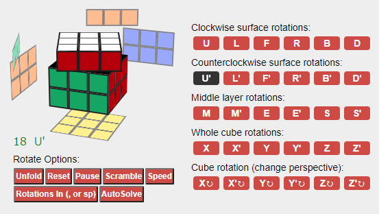

# Cubing
Cube-game assisting tools

 　<strong>Rotation symbol names and 3D Rubik's Cube result</strong>
(<button type=button onclick="openSwin(this)">Sub wndow</button>)

<table><tr><td>　</td><td><a target="_blank" height="40px" width="800px" scrolling="yes" frameborder="0" href="https://mori1-hakua.tokyo/python/Cube2phase_Fast2.py?value1=">Automatic resolve Copied rotations</a>
</td></tr>
<tr><td>　</td><td><a target="_blank" height="540px" width="300px" scrolling="no" frameborder="0" href="https://mori1-hakua.tokyo/cube-unfold.html">3D CUBE</a>
</td><tr><td>　</td><td>Scramble-A: L' R2 U2 F2 U2 F2 D' R2 D' F U' L D' R D' F' L <button type="button" onclick="RotCopy(this)">(-copy)</button> 
</td><tr><td>　</td><td>Scramble-B: R' U' F L F2 L2 B2 R F2 R2 F2 R' B' R' D U' F2 U2 R F U2 B' R' U' F <button type="button" onclick="RotCopy(this)">(-copy)</button> 
</td></tr>
</table>

  

